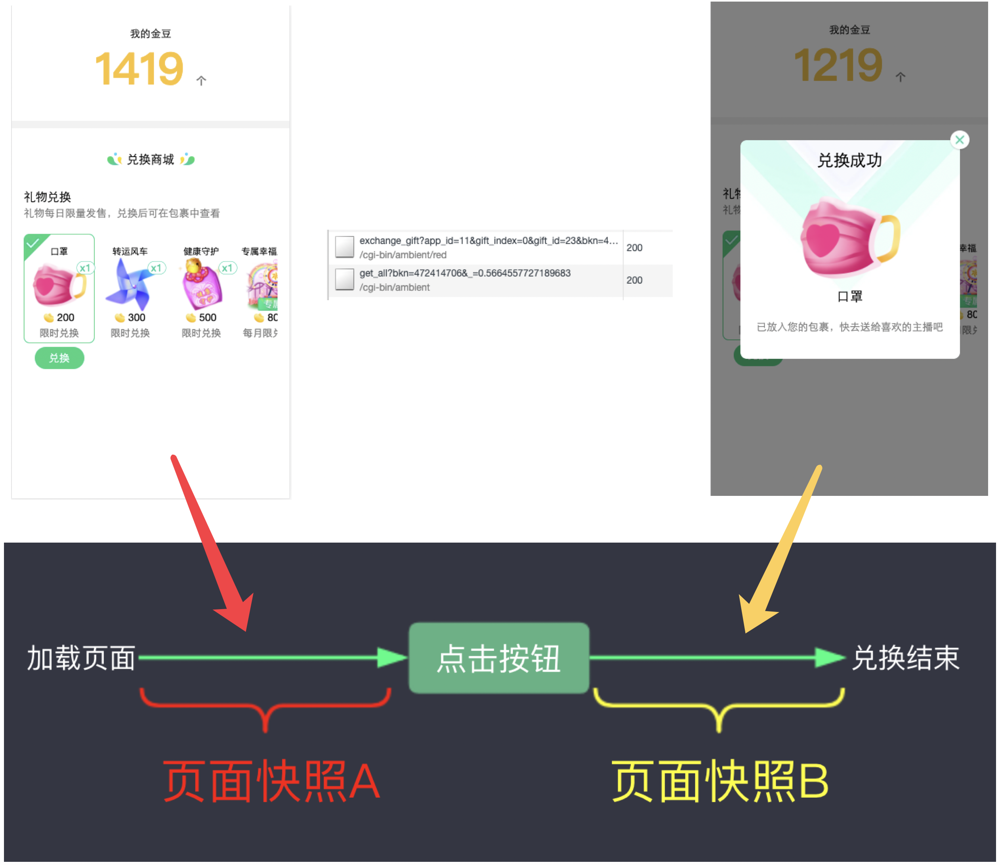

# 页面快照

页面快照是某个时间段内完整的页面状态，包含了多维度信息。

## 1. 页面快照包含什么？

“页面快照”的提出参考了搜索引擎中“网页快照”的概念，但它却并仅限页面，它是某一个时间段内完整的页面状态，包含了：

- UI 信息及 DOM 变化
- 网络请求（CGI、数据上报）
- 资源加载
- jsbridge 调用
- JS runtime
- 浏览器其他事件
- ...

## 2. 每次的交互行为会产生新的"页面快照"

一个交互行为必然会产生一定的变化，变化之前和变化之后是两个不同的页面快照。

## 3. 举例说明

假如我们有个功能是"红包商城兑换"，支持"兑换礼物"，如下图所示。用户点击了"兑换"之后，会产生两份页面快照：页面快照 A 和页面快照 B 。两份快照之间是有很多区别的，举例而言：

- UI方面："金豆" 数量不一样，快照 A 无弹窗，快照 B 有弹窗...
- 网络请求方面：因为点击了"兑换"按钮，所以快照 B 中其实是包括了额外的两条接口请求
- ...

## 4. 如何测试页面快照

页面快照对于程序而言是不友好的。比如一个按钮从可点击变为不可点击，我们可以一眼看出来，但程序无法感知。程序适合处理数据，因此我们还需要将其转换为程序可识别的数据，这就是 [数据快照](./data-snapshot.md)。

更多细节请查看 [数据快照](./data-snapshot.md) 一章。

