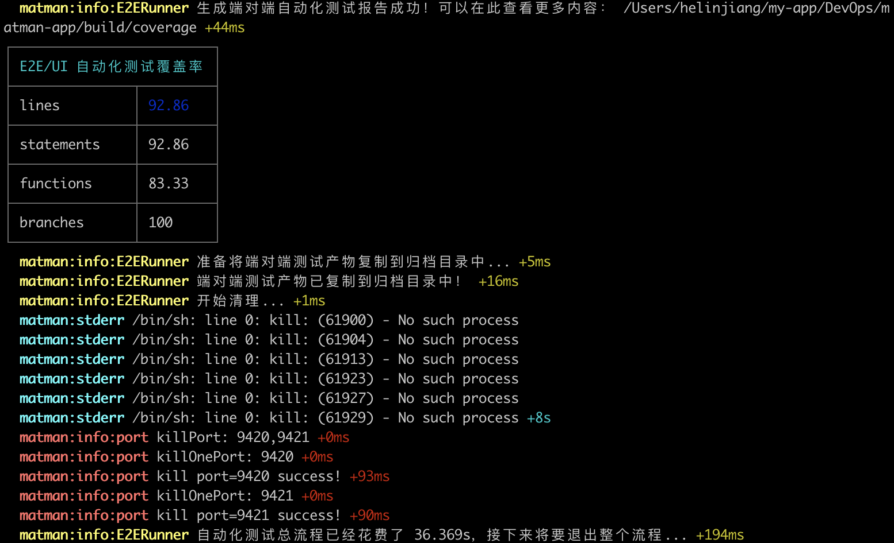
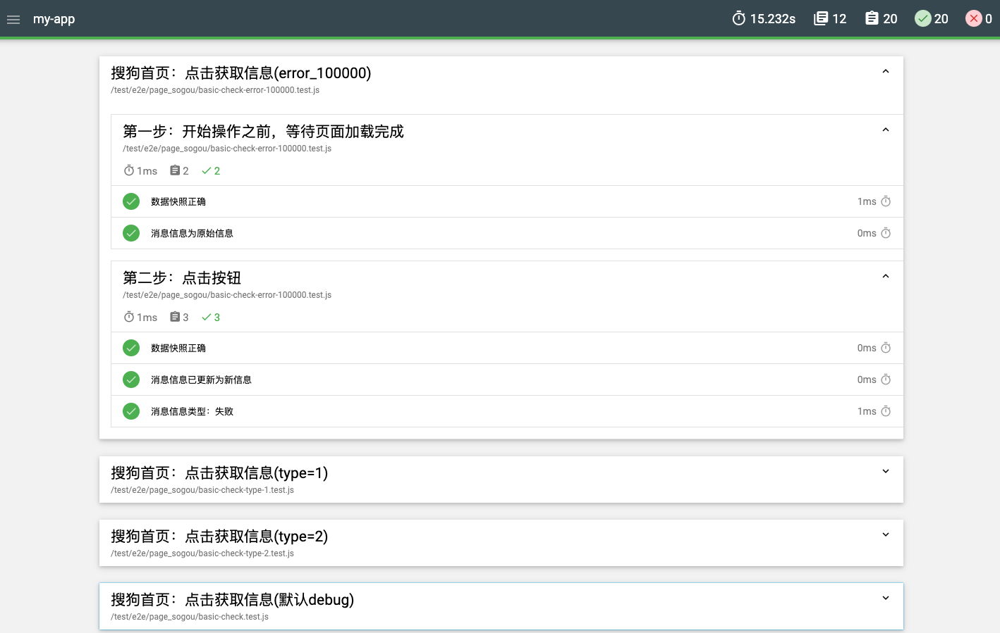
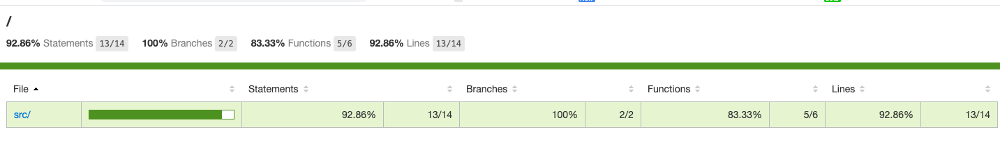
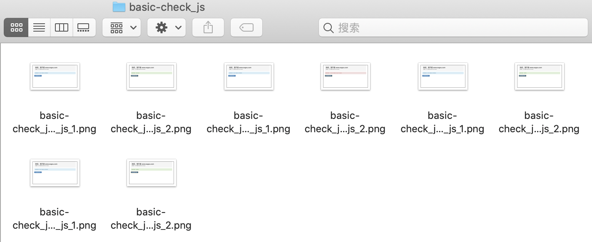

# 快速开始

[create-matman-app](https://www.npmjs.com/package/create-matman-app) 主要用来初始化使用 Matman 做 web 自动化测试的项目。

## 1. 创建项目

使用下面的一个命令，即可以创建一个名字为 `my-app` 的项目：

> 注意，如果遇到无法安装或执行的情况，可能是因为 npm 未正确配置，可以参考 [安装和升级](../install.html) 一文配置 npm 。

```bash
$ npx create-matman-app my-app
```

<div style="text-align: center"></div>


## 2. 执行测试命令

初始化的项目是一个简单但完整的项目，在命令执行完成之后，进入到项目中，直接执行测试命令：

```bash
$ cd my-app
$ npm run test:e2e
```



在项目根目录下会产出测试产物 `.matman_output`，重点关注：

1. `.matman_output/mochawesome`：执行结果，可以在浏览器中打开 `.matman_output/mochawesome/mochawesome.html`


2. `.matman_output/e2e/coverage`：代码覆盖率，可以在浏览器中打开 `.matman_output/e2e/coverage/index.html`


3. `.matman_output/e2e_build_output/screenshot_output`：测试过程的截图



## 3. 试一试

可以参考我们的 [练习指引](https://github.com/matmanjs/test-automation-training/blob/master/sample-create-matman-app/Training.md) 试一试！
