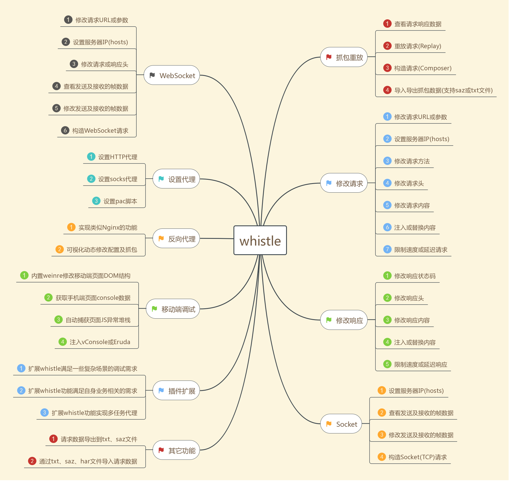
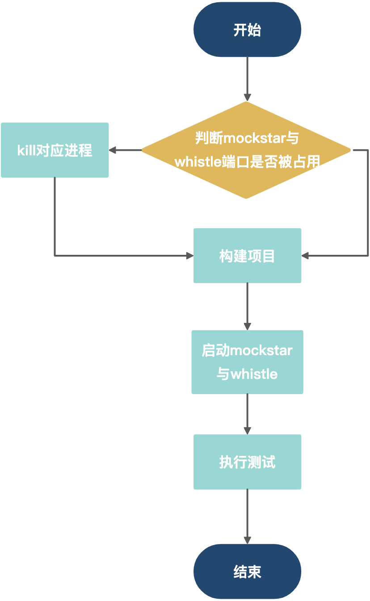
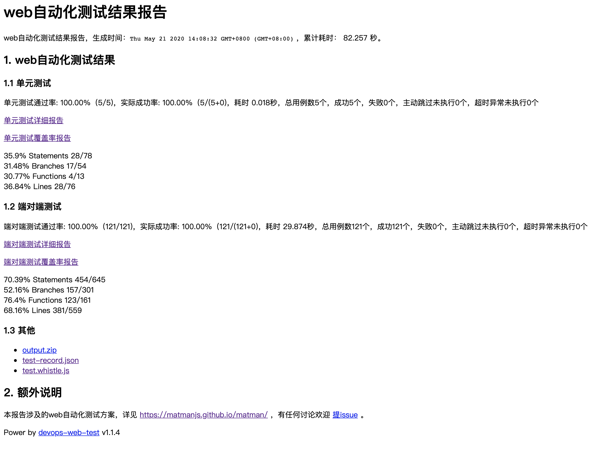
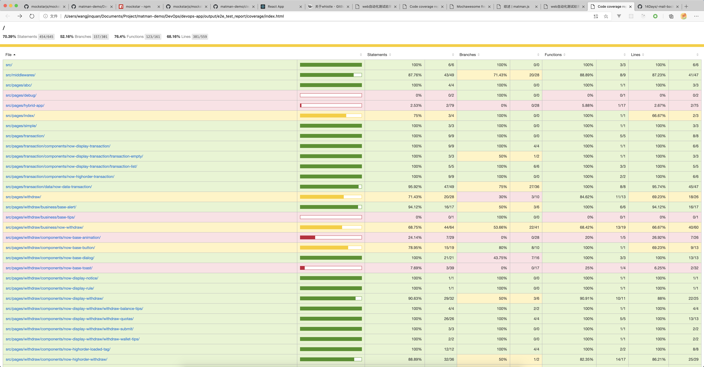

# 01. 综述

从本节开始，我们将结合一个包含了`简单静态页面`、`单一接口展示型界面`、`重交互性界面`、`Hybrid APP`的 React 项目学习 matman 的使用方法。

## 1. 技术概览

### 1.1 matman

 [matman](https://github.com/matmanjs/matman) 是一个用于**web 端对端测试**（E2E，End-to-End Testing）的框架，它提供了一整套方案，十分适合 web 前端开发人员来编写端对端测试。拥有更适合 **web 前端开发者使用**、**更适合单页面的精细化测试**等特点。

### 1.2 mockstar

[mockStar](https://github.com/mockstarjs/mockstar) 是一个用于**构造及管理桩数据**（模拟数据）的工具。也是我们推荐的数据 Mock 工具。

它具有以下特点：

- 支持多种方式灵活构造桩数据
- 支持独立的管理端自由切换不同桩数据
- 支持基于 XHR 场景的数据打桩
- 支持异步调用场景（例如 JSBridge 异步回调等）的数据打桩
- 支持 E2E（端对端）测试等场景

### 1.3 whistle

[whistle](https://github.com/avwo/whistle) 是基于 Node 实现的跨平台 Web 调试代理工具，类似的工具有 Windows 平台上的[Fiddler](http://www.telerik.com/fiddler/)，主要用于查看、修改 HTTP、HTTPS、Websocket 的请求、响应，也可以作为 HTTP 代理服务器使用，不同于 Fiddler 通过断点修改请求响应的方式，whistle 采用的是类似配置系统 hosts 的方式，一切操作都可以通过配置实现，支持域名、路径、正则表达式、通配符、通配路径等多种[匹配方式](https://wproxy.org/whistle/pattern.html)，且可以通过 Node 模块[扩展功能](https://wproxy.org/whistle/plugins.html)。



同样 mockstar 同样是我们推荐的数据 mock 工具。

## 2. 目录结构

```text
.
├── DevOps
│   ├── devops-app
│   ├── matman-app
│   ├── mockstar-app
│   └── whistle
├── LICENSE
├── README.md
├── config-overrides.js
├── package-lock.json
├── package.json
├── public
├── src
└── test
    ├── e2e
    └── unit
```

### 2.1 DevOps

> 包含了我们执行测试需要的所有文件，其中 mockstar-app 与 whistle 如果大家不需要数据 mock 以及网络代理可以忽略，我们接下来的文章也不会着重介绍这俩部分。

- devops-app：执行测试的总控程序，在这个程序中我们执行**文件清理、构建环境、执行测试、文件归档**等操作
- matman-app：主要执行 E2E 测试，捕捉**数据快照**
- mockstar-app：生成 mock 数据，进行测试
- whistle：向全局的 whistle 中**添加代理规则**

### 2.2 test

本文件夹中我们编写测试用例：

- e2e：端到端测试的测试用例文件
- unit：单元测试用例文件

## 3. 运行

### 3.1 启动过程



启动过程如上图所示：

1. 判断端口是否被占用，若被占用则杀掉占用进程
2. 构建被测试的项目
3. 启动 mockstar 与 whistle
4. 执行测试，输出文件

### 3.2 启动命令

在终端中执行下面的命令即可查看效果：

```bash
$ npm test
```

## 4. 运行结果

执行 `npm test` 命令，我们可以在 `/DevOps/devops-app/output` 文件夹中查看所有的输出文件，一般情况下用浏览器打开 **index.html** 即可

### 4.1 综合入口

#### 4.1.1 概览



输出文件会包括下面几部分：

- **单元测试**
  - 单元测试报告
  - 单元测试覆盖率报告
- **端到端测试**
  - 端到端测试报告
  - 端到端测试覆盖率报告
- 所有文件的压缩包
- 测试生成的 JSON 结果
- whistle 的代理规则

#### 4.1.2 文件目录

下面，我们给出 `output` 的目录结构：

```text
.
├── e2e_test_build_output
│   ├── crawler-script
│   ├── matman_result_output
│   └── screenshot_output
├── e2e_test_report
│   ├── assets
│   ├── coverage
│   ├── mocha-multi-reporters-config.json
│   ├── mochawesome.html
│   ├── mochawesome.json
│   └── test-result.xml
├── index-html.json
├── index.html
├── output.zip
├── test-record.json
├── test.whistle.js
└── unit_test_report
    ├── assets
    ├── coverage
    ├── mocha-multi-reporters-config.json
    ├── mochawesome.html
    ├── mochawesome.json
    └── test-result.xml
```

##### e2e_test_build_output

- crawler-script：页面爬虫脚本
- matman_result_output：中间结果json
- screenshot_output：屏幕截图结果

##### e2e_test_report

端到端测试生成的测试报告与覆盖率报告

##### unit_test_report

单元测试生成的测试报告与覆盖率报告

### 4.2 单元测试（UT）

测试报告：


覆盖率报告：


### 4.3 端到端测试（E2E）

测试报告：


覆盖率报告：

