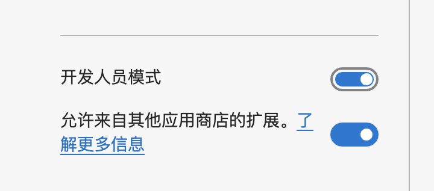
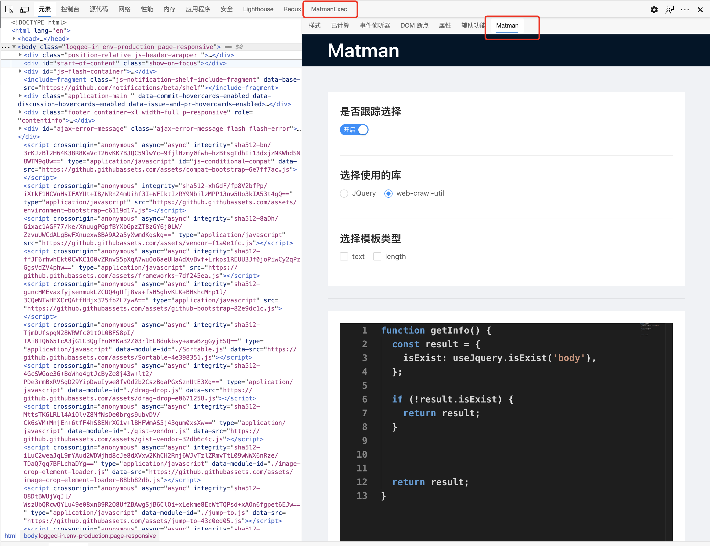

# matman-devtools

## 安装

> 首先需要大家自行安装 [Node.js](http://nodejs.cn/) 环境

### clone & build

1. 进入 [matman-devtools](https://github.com/matmanjs/matman-devtools)，复制链接、克隆项目：

```bash
$ git clone https://github.com/matmanjs/matman-devtools.git
```

2. 安装根项目依赖：

```bash
$ npm install
```

3. 执行编译打包

```bash
$ npm run build:install
```

### 在浏览器中安装

> 因审查原因暂时还未上架拓展商店

1. 打开 chrome 浏览器（文档中使用的是 `edge` 浏览器），访问 `chrome://extensions/`：


2.  打开插件的“开发者模式”：



3. 点击 "加载已解压的扩展程序"，然后选择到本项目的 `build` 目录即可


## 使用

> 在安装之后将会在控制台生成两个面板，分别为：
>
> - 负责代码片段生成与页面元素选择的 `Matman` 面板（在 Element 面板中，与 Styles 面板平级）
> - 负责在浏览器上下文中进行执行的 `MatmanExec` 面板（与 Element 面板平级）
>
> 同时我们将在浏览器的上下文中注入 3 个库供大家使用：`JQuery`、`web-crawler-utils`、`lodash`

选择需要审查的页面，打开开发者工具可以查看到：



### 元素审查 & 代码生成

只需要正常的选择元素，在旁边的面板中即可生产对应的代码片段


### 自动执行

我们可以将代码复制，或者直接在 MatmanExec 中进行代码编辑，进行爬虫脚本代码的测试工作

