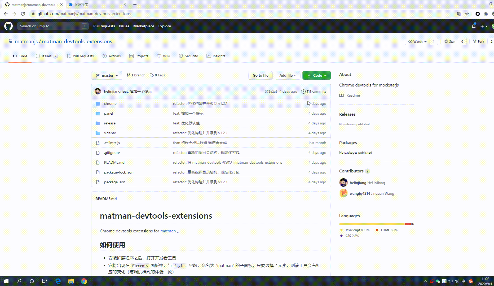
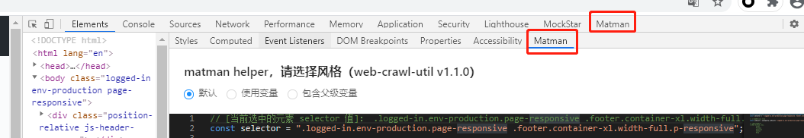
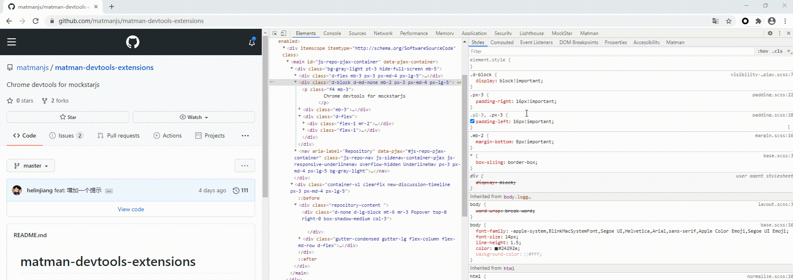
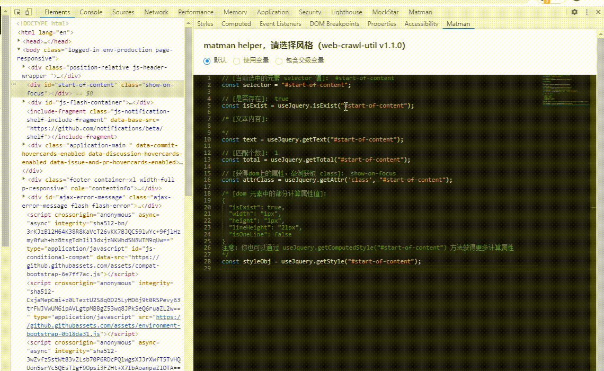

# Chrome 插件：Matman

## 安装

> 首先需要大家自行安装 [Node.js](http://nodejs.cn/) 环境

*git仓库： https://github.com/matmanjs/matman-devtools-extensions*

### 压缩包安装(推荐)

- 进入: [matman-devtools](https://github.com/matmanjs/matman-devtools)
- 下载 `release/` 目录下的zip包至本地
- 解压zip包，加载解压后的插件
- 操作过程如下所示


### 源码安装

1. 进入 [matman-devtools](https://github.com/matmanjs/matman-devtools)，克隆项目

```bash
$ git clone https://github.com/matmanjs/matman-devtools.git
```

2. 安装根项目依赖：

```bash
$ npm install
```

3. 执行编译打包

```bash
$ npm run build:chrome
```



4. 浏览器加载构建出来的插件chrome-extensions


## 使用

在安装之后将会在控制台生成两个面板，分别为：

> - 负责代码片段生成与页面元素选择的 `Matman` 面板（Helper面板）
> - 负责在浏览器上下文中进行执行的 `Matman` 面板（执行面板）

选择需要审查的页面，打开开发者工具可以查看到：




### Matman helper

当选择元素时，面板中可生成对应代码片段。可以通过拷贝生成代码至项目中，节省开发时间。



### 执行面板

我们可以将代码复制，或者直接在 Matman 中进行代码编辑，进行爬虫脚本代码的测试工作。


