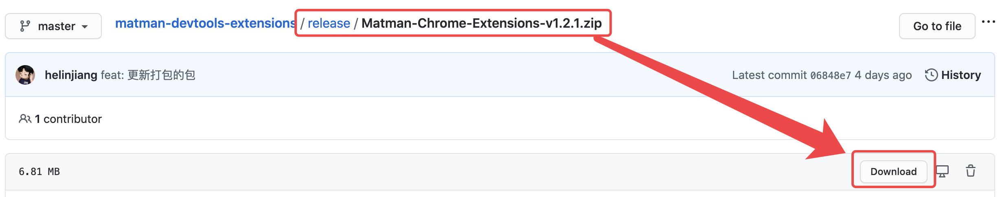

# Chrome 插件：Matman Developer Tools

Matman Developer Tools 是一个 Chrome 扩展插件 （Chrome DevTools extension），是为了让 Matman 的使用变得更简单。配合本插件，可以极大提升开发效率。

> 如果还不熟悉 Matman 框架，请参考： [Matman 官方文档](https://matmanjs.github.io/matman/)


## 1. 如何安装

### 1.1 chrome应用商店安装

> chrome 应用商店的版本有些问题，暂不建议使用，正在修复中...


### 1.2 源码安装

我们强烈推荐从源码安装，这样可以获得最新的最新的版本（Chrome 应用商店审核一般比较延迟）。打开 [https://github.com/matmanjs/matman-devtools-extensions/tree/master/release](https://github.com/matmanjs/matman-devtools-extensions/tree/master/release) ，可以看到压缩好的安装包（格式为 `Matman-Chrome-Extensions-vx.x.x.zip`），点击进入，找到 `download` 按钮，即可将其下载到本地。


你也可以直接克隆仓库代码，在 `release` 目录下找到该文件。

```bash
$ git clone https://github.com/mockstarjs/mockstar-devtools-extensions
```

获得 `zip` 包之后，将该文件进行解压，可以看到一个 `chrome-extensions` 文件夹。

打开浏览器扩展程序，开启右上角 `开发者模式`，既可以看到 `加载已解压的扩展程序` 按钮，点击它之后，，选中刚刚解压得到的`chrome-extensions` 文件夹。




你也可以直接克隆仓库代码，在 `release` 目录下找到该文件。

```bash
$ git clone https://github.com/matmanjs/matman-devtools-extensions.git
```

获得 `zip` 包之后，将该文件进行解压，可以看到一个 `chrome-extensions` 文件夹。

打开 Chrome 浏览器，在地址栏输入 [chrome://extensions/](chrome://extensions/)，开启右上角 `开发者模式`，既可以看到 `加载已解压的扩展程序` 按钮，点击它之后，，选中刚刚解压得到的`chrome-extensions` 文件夹。


<center>图一</center>

检查插件安装情况

- 确保图一中的插件已经存在插件列表
- 查看开发者工具中（F12）是否存在 `Matman` (如果之前已经开启了开发者调试模式，则需要关闭再重新打开)


<center>图二</center>

如图二所示，能够看到 Matman，表示已成功安装。


## 2. 使用指南

在安装之后将会在控制台生成两个面板，分别为：

> - 负责代码片段生成与页面元素选择的 `Matman` 面板（Helper面板）
> - 负责在浏览器上下文中进行执行的 `Matman` 面板（执行面板）

选择需要审查的页面，打开开发者工具可以查看到：


### 2.1 Matman helper

当选择元素时，面板中可生成对应代码片段。可以通过拷贝生成代码至项目中，节省开发时间。


### 2.2 执行面板

我们可以将代码复制，或者直接在 Matman 中进行代码编辑，进行爬虫脚本代码的测试工作。


## 3. FAQ

暂无。

## 4. 反馈

本项目的代码仓库地址： [https://github.com/matmanjs/matman-devtools-extensions](https://github.com/matmanjs/matman-devtools-extensions) ，欢迎给我们 [提 Issue](https://github.com/matmanjs/matman-devtools-extensions/issues/new) 。

