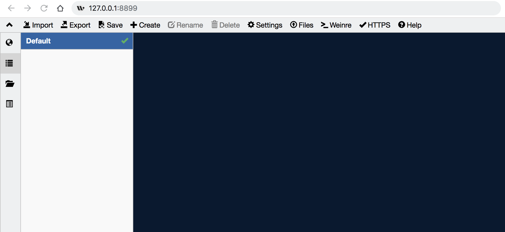

# whistle

参考 [whistle中文文档](https://github.com/avwo/whistle/blob/HEAD/README-zh_CN.md)

## 安装

### Node

matman 是基于 Node 来实现的，因此需要在本机安装 Node 。

为了获得更好的性能，推荐安装最新版本的 Node，进入 https://nodejs.org/ 官网，选择 LTS 版本的 Node 安装即可。

安装完Node后，执行下面命令，查看当前Node版本：

```bash
$ node -v
v4.4.0
```

如果能正常输出Node的版本号，表示Node已安装成功(Windows系统可能需要重新打开cmd)。

### whistle

安装方式如下：

```bash
# 安装tnpm
npm install @tencent/tnpm -g --registry=http://r.tnpm.oa.com --no-proxy

# 安装whistle
tnpm install -g whistle @tencent/whistle.txpac
```

安装完whistle后，执行下面命令，查看当前whistle版本：

```bash
$ w2 -V
1.15.10
```

如果能正常输出whistle的版本号，表示whistle已安装成功(Windows系统可能需要重新打开cmd)。

## 运行

在终端/控制台下运行如下命令可以启动whistle

```bash
hebly723-MC1:matman-demo hebly723$ w2 start
[i] whistle@1.15.10 restarted
[i] 1. use your device to visit the following URL list, gets the IP of the URL you can access:
       http://127.0.0.1:8899/
       http://10.64.66.73:8899/
       Note: If all the above URLs are unable to access, check the firewall settings
             For help see https://github.com/avwo/whistle
[i] 2. configure your device to use whistle as its HTTP and HTTPS proxy on IP:8899
[i] 3. use Chrome to visit http://local.whistlejs.com/ to get started
```

默认情况下，whistle启动在 http://127.0.0.1:8899/ ，打开该链接，可以看到如下界面：



如果想换其余的端口比如8080打开whistle的话，可以使用以下的命令

```bash
w2 restart -p 8080
```