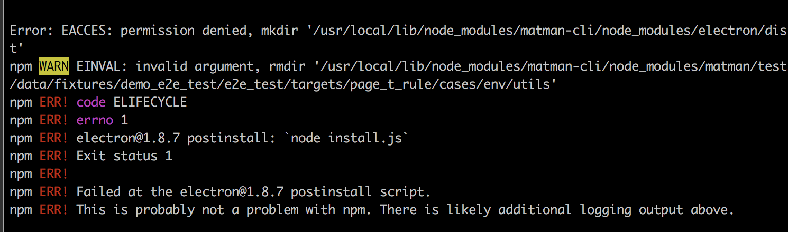

# 常见问题


## 1. permission denied


在 mac 电脑上，全局安装 `matman-cli` 时，需要用 `sudo`，即

```bash
$ sudo npm install matman-cli -g
```

另外，还可能会遇到另外一种情况，就是由于 electron 带来的权限问题，详见 https://github.com/matmanjs/matman-cli/issues/30。



请使用如下命令安装：

```bash
$ npm install matman-cli -g --unsafe-perm=true --allow-root
```
