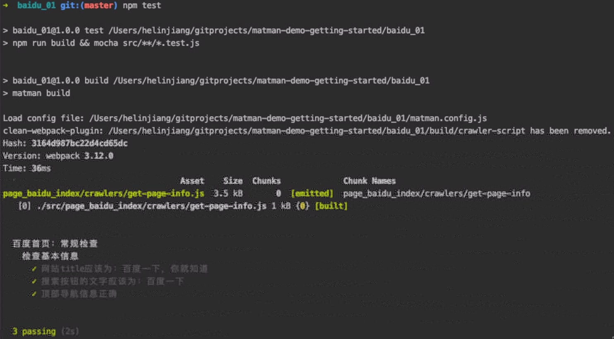

# 01. 第一个端对端测试

本节我们将实现：测试 [https://www.baidu.com](https://www.baidu.com) 首页的UI布局。

> 最终的代码参考： [https://github.com/matmanjs/matman-demo-getting-started/tree/master/baidu_01](https://github.com/matmanjs/matman-demo-getting-started/tree/master/baidu_01)

## 1. 创建项目 baidu_01 并初始化

新建一个目录命名为 `baidu_01` ，使用 `npm init` 命令初始化，然后安装 [matman](http://npmjs.com/package/matman) 与支持单元测试必要的包（在这里选用了 [mocha](http://npmjs.com/package/mocha) +  [chai](http://npmjs.com/package/chai)）：

```bash
$ npm i matman
$ npm i -D chai cross-env mocha 
```

你也可以手动新建一个 `package.json` ，拷贝下面的内容，然后执行 `npm i` 命令：

```json
{
    "name": "baidu_01",
    "version": "1.0.0",
    "scripts": {
        "test": "mocha",
        "test:show": "cross-env SHOW_BROWSER=1 npm run test"
    },
    "dependencies": {
        "matman": "^5.0.6"
    },
    "devDependencies": {
        "chai": "^4.2.0",
        "cross-env": "^7.0.2",
        "mocha": "^7.1.2"
    }
}
```

## 2. 目录结构

```text
.
├── case_modules
│   └── page_baidu_index
│       └── basic-check.js
├── package.json
└── test
    ├── basic-check-in-single-file.test.js
    └── basic-check.test.js
```

### 2.1 `test` 目录

> 本目录完成 mocha 的一系列测试文件，用于测试数据快照的合法性

编写 mocha 的测试文件，目录中的两个文件说明如下：

- basic-check-in-single-file：将 matman 获取数据快照与 mocha 测试集集成在一起
- basic-check：通过 before 获取数据快照，仅包含 mocha 测试集

### 2.2 `case_modules` 目录

> 本目录完成使用 matman 获取页面数据快照逻辑的编写，包括被测试的页面加载到无头浏览器之后的行为、页面信息、网络请求和其他信息的爬虫

- page_baidu_index 目录：我们推荐使用 `page_<二级域名>_<URI>` 命名同一个页面的不同数据快照获取方式
- basic-check：通过 `matman` 获取数据快照的方法

## 3. 编写端对端测试

### 3.1 编写数据快照爬虫脚本

编写数据快照爬虫，内容如下（需要注意的是在本项目中为出现此函数，而是直接写在了 `matman` 流程中）：

```js
const spider = () => {
    return {
        title: document.title,
        width: window.innerWidth,
        height: window.innerHeight,
        userAgent: navigator.userAgent,
        _version: Date.now(),
        searchBtnTxt: document.querySelector('#su').value,
        navInfo: getNavInfo()
    };
};
```

### 3.2 编写无头浏览器操作

在 `case_modules/page_baidu_index.js` 文件，写入如下内容

```javascript
module.exports = (opts) => {
    const MATMAN_ROOT_PATH = path.join(__dirname, '../../');

    return matman

        // 创建 Browser 对象，使用它对浏览器进行设置
        .launch({ show: opts.show })

        // 创建 Page 对象，使用它可以实现对浏览器页面的控制
        .newPage(__filename, Object.assign({
            rootPath: MATMAN_ROOT_PATH
        }, opts))

        // 设置浏览器参数
        .setDeviceConfig({
            'UA': 'Mozilla/5.0 (Windows NT 10.0; Win64; x64) AppleWebKit/537.36 (KHTML, like Gecko) Chrome/62.0.3202.75 Safari/537.36 mycustomua',
            'width': 1250,
            'height': 400
        })

        // 设置截屏
        .setScreenshotConfig(true)

        // 加载页面地址
        .goto('https://www.baidu.com')

        // 需要等待某些条件达成，才开始运行爬虫脚本
        .wait('#su')

        // 爬虫脚本的函数，用于获取页面中的数据
        .evaluate(() => {
            return {
                title: document.title,
                width: window.innerWidth,
                height: window.innerHeight,
                userAgent: navigator.userAgent,
                _version: Date.now(),
                searchBtnTxt: document.querySelector('#su').value
            };
        })

        // 结束，获取结果
        .end();
};
```

#### 3.2.1 流程概览

> 这里我们只介绍脚本执行的大致流程，具体的 API 可以[参考](../../api)

1. launch：创建 Browser 对象，使用它对浏览器进行设置
2. newPage：创建 Page 对象，使用它可以实现对浏览器页面的控制
3. setDeviceConfig：设置浏览器参数
4. setScreenshotConfig：设置截屏（页面截图保存在 `/build/screenshot_output` 中）
5. goto：加载页面地址
6. wait：需要等待某些条件达成，才开始运行爬虫脚本
7. evaluate：爬虫脚本的函数，用于获取页面中的数据
8. end：结束，获取结果

#### 3.2.2 自测

```js
module.exports({ show: true, doNotEnd: true, useRecorder: false })
     .then(function (result) {
         console.log(JSON.stringify(result));
     })
     .catch(function (error) {
         console.error('failed:', error);
     });
```

编写完成后，如果要自测，可以在文件末尾的注释加入如上代码，然后用 node 执行该文件。


## 4. 编写测试用例

### 不集成 `matman`

新增 `test/basic-check.test.js` 文件，内容如下：

```js
describe('百度首页：常规检查', function () {
    this.timeout(30000);

    let resultData;

    before(function () {
        return checkPage({ show: process.env.SHOW_BROWSER || false, doNotCloseBrowser: false, useRecorder: true })
            .then(function (matmanResult) {
                // console.log(JSON.stringify(result));
                resultData = matmanResult;
            });
    });

    describe('检查基本信息', function () {
        let data;

        before(function () {
            data = resultData.data;
        });

        it('网站title应该为：百度一下，你就知道', function () {
            expect(data.title).to.equal('百度一下，你就知道');
        });

        it('搜索按钮的文字应该为：百度一下', function () {
            expect(data.searchBtnTxt).to.equal('百度一下');
        });

        it('userAgent应该正确', function () {
            expect(data.userAgent).to.equal('Mozilla/5.0 (Windows NT 10.0; Win64; x64) AppleWebKit/537.36 (KHTML, like Gecko) Chrome/62.0.3202.75 Safari/537.36 mycustomua');
        });
    });
});
```

### 集成 `matman`

新增 `test/basic-check-in-single-file.test.js` 文件，内容如下：

```javascript
describe('百度首页：常规检查，使用单文件形式', function () {
    this.timeout(30000);

    it('检查基本信息', function (done) {
        const MATMAN_ROOT_PATH = path.join(__dirname, '../');

        matman

            // 创建 Browser 对象，使用它对浏览器进行设置
            .launch({ show: process.env.SHOW_BROWSER || false })

            // 创建 Page 对象，使用它可以实现对浏览器页面的控制
            .newPage(__filename, {
                show: process.env.SHOW_BROWSER || false,
                doNotCloseBrowser: false,
                useRecorder: true,
                tag: __filename,
                rootPath: MATMAN_ROOT_PATH,
                caseModulesPath: __dirname
            })

            // 设置浏览器参数
            .setDeviceConfig({
                'UA': 'Mozilla/5.0 (Windows NT 10.0; Win64; x64) AppleWebKit/537.36 (KHTML, like Gecko) Chrome/62.0.3202.75 Safari/537.36 mycustomua',
                'width': 1250,
                'height': 400
            })

            // 设置截屏
            .setScreenshotConfig(true)

            // 加载页面地址
            .goto('https://www.baidu.com')

            // 需要等待某些条件达成，才开始运行爬虫脚本
            .wait('#su')

            // 爬虫脚本的函数，用于获取页面中的数据
            .evaluate(() => {
                return {
                    title: document.title,
                    width: window.innerWidth,
                    height: window.innerHeight,
                    userAgent: navigator.userAgent,
                    _version: Date.now(),
                    searchBtnTxt: document.querySelector('#su').value
                };
            })

            // 结束，获取结果
            .end()
            .then(function (matmanResult) {
                // console.log(JSON.stringify(matmanResult));
                const { data } = matmanResult;

                // 网站title应该为：百度一下，你就知道
                expect(data.title).to.equal('百度一下，你就知道');

                // 搜索按钮的文字应该为：百度一下
                expect(data.searchBtnTxt).to.equal('百度一下');

                //userAgent应该正确
                expect(data.userAgent).to.equal('Mozilla/5.0 (Windows NT 10.0; Win64; x64) AppleWebKit/537.36 (KHTML, like Gecko) Chrome/62.0.3202.75 Safari/537.36 mycustomua');

                done();
            });
    });
});
```

- 集成 `matman` 的部分可以参考[3.2 编写无头浏览器操作](./baidu_01.md#_3-2-编写无头浏览器操作)
- 我们更推荐将 mocha 或 jest 测试样例与 `matman` e2e 测试分开写

## 5. 执行测试

运行如下命令，执行端对端测试：

```bash
$ npm test
```



同时，由于我们配置了测试过程截图，因此可以在 `build/screenshot/page_baidu_index_cases` 目录下看到截图：

