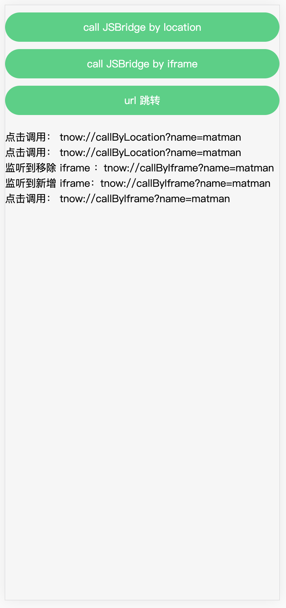

# 05. JSBridge

本节我们将通过 `iframe` 与 `location` 两种方式调用 JSBridge，并进行测试。

## 1. 测试概述



本页面中，我们通过两种方式对 JSBridge 进行了调用，其实对于编写测试的话是基本相同的。

我们只需要：

- 调用 matman 中的 `拦截器` 功能，拦截用户发出的请求
- 通过 `result 对象` 中的 isExistJSBridge 判断即可

## 2. 获取页面数据快照

> 在这个案例中，我们不需要编写爬虫脚本获取 DOM 信息
>
> 本节中针对 iframe 和 location 的案例基本相同，只是点击的按钮不同，不再重复给出。

以 iframe 的为例，详细代码请 [参考](https://github.com/matmanjs/matman-demo/tree/master/DevOps/matman-app/case_modules/page-hybrid-app)。

```js
const { createPageDriver } = require('../../helpers');
const { WAIT } = require('./env');

module.exports = async pageDriverOpts => {
  // 创建 PageDriver
  const pageDriver = await createPageDriver(__filename, pageDriverOpts);

  await pageDriver.setPageUrl('http://now.qq.com/hybrid-app');

  // 第一步：开始操作之前
  await pageDriver.addAction('init', async page => {
    await page.waitFor(WAIT.READY);
  });

  // 第二步：点击使用 iframe 调用 jsbridge
  await pageDriver.addAction('clickJsBridge', async page => {
    await page.click('#call-by-iframe');
  });

  return await pageDriver.evaluate(() => {
    return {
      remarks: '调试使用 iframe 调用 jsbridge',
    };
  });
};
```

## 3. 测试样例文件

和上面类似，我们也仅仅给出以 iframe 为例的测试样例，完整代码请 [参考](https://github.com/matmanjs/matman-demo/tree/master/test/e2e/page-hybrid-app)。

```js
describe('hybrid 页面：使用 iframe 方式调用 jsbridge', function () {
  this.timeout(30000);

  let matmanResult;

  before(async function () {
    matmanResult = await checkPage({
      show: false,
      doNotCloseBrowser: false,
      useRecorder: true,
    });
  });

  describe('实际调用了 tnow://callByIframe?name=matman', function () {
    it('tnow://callByIframe 匹配成功', function () {
      expect(matmanResult.isExistJSBridge('tnow://callByIframe')).to.be.true;
    });

    it('tnow://callByIframe?name=matman 匹配成功', function () {
      expect(matmanResult.isExistJSBridge('tnow://callByIframe?name=matman')).to.be.true;
    });

    it('tnow://callByIframe 且 {"name":"matman"} 匹配成功', function () {
      expect(matmanResult.isExistJSBridge('tnow://callByIframe', { name: 'matman' })).to.be.true;
    });
  });
});
```

可以看到我们直接调用 `matmanResult` 中的内建方法，即可判断。

## 4. 测试结果


