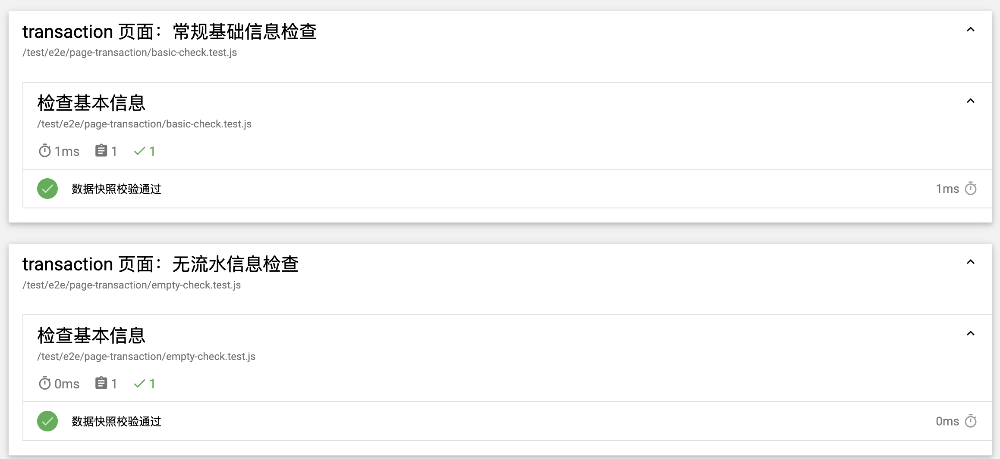

# 03. 单一接口展示型页面

本节我们将会通过一个单一接口的展示型页面，为大家展示如何检测接口的不同返回结果在页面上的表现。

## 1. 测试概述


单一接口展示型页面的两种情况如上。

我们需要验证的情况有下面两种：

- 返回数据时正确显示列表
- 当列表为空时，显示正确的 empty 状态

我们的测试思路很简单，分别获取不同的 DOM 信息进行判断即可

## 2. 获取页面数据快照

### 2.1 爬虫脚本

在 `DevOps/matman-app/case_modules/page-transaction/crawlers/get-page-info.js` 文件中，有我们获取页面信息内容的脚本

```js
const { useJquery } = require('web-crawl-util');

module.exports = () => {
  return {
    transactionListInfo: getTransactionListInfo(),
  };
};

/**
 * 列表项信息
 */
function getListTransactionItemInfo(parentSelector) {
  const result = {
    isExist: useJquery.isExist(parentSelector),
  };

  if (result.isExist) {
    result.name = useJquery.getText('.info .flow-info', parentSelector);
    result.time = useJquery.getText('.info .flow-time', parentSelector);
    result.money = useJquery.getText('.money', parentSelector);
    result.isExpire = useJquery.isExist('.dated-icon', parentSelector);
    result.id = $(parentSelector).attr('data-id');
  }

  return result;
}

/**
 * 列表信息
 */
function getTransactionListInfo() {
  const parentSelector = '#root .display-transaction';

  const result = {
    isExist: useJquery.isExist(parentSelector),
  };

  if (result.isExist) {
    // 总数
    result.total = useJquery.getTotal('.display-transaction-list .list-item', parentSelector);

    const list = [];

    $('.display-transaction-list .list-item', parentSelector).each(function () {
      list.push(getListTransactionItemInfo($(this)));
    });

    // 列表内容
    result.list = list;

    // 列表为空时的文字
    result.emptyWording = useJquery.getText('.display-transaction-empty p', parentSelector);
  }

  return result;
}

```

### 2.2 启动脚本

在 `DevOps/matman-app/case_modules/page-transaction/crawlers/get-page-info.js` 文件中，我们利用matman 编写端到端测试的逻辑，内容如下（需要注意的是我们一定需要一个 action 这样才可以捕捉页面的快照）：

```js
const path = require('path');
const { createPageDriver } = require('../../helpers');
const { BASIC_QUERY_DATA_MAP, WAIT } = require('./env');

module.exports = async pageDriverOpts => {
  // 创建 PageDriver
  const pageDriver = await createPageDriver(__filename, pageDriverOpts, BASIC_QUERY_DATA_MAP);

  // 设置页面地址
  await pageDriver.setPageUrl('http://now.qq.com/transaction');

  // 增加自定义动作
  await pageDriver.addAction('init', async page => {
    await page.waitFor(WAIT.READY);
  });

  // 获取结果
  return await pageDriver.evaluate(path.resolve(__dirname, './crawlers/get-page-info.js'));
};
```

使用 matman 执行无头浏览器模拟浏览，调用爬虫脚本得到数据快照。

## 3. 测试样例文件

在 `test/e2e/page-transaction/basic-check.test.js` 文件中，我们可以对捕捉到的页面快照进行校验，确认页面状态（这里我们进行确认的是 `成功` 获取到页面列表的情况）：

```js
const {expect} = require('chai');

const checkPage = require('../../../DevOps/matman-app/case_modules/page-transaction/basic-check');

describe('transaction 页面：常规基础信息检查', function () {
  this.timeout(30000);

  let matmanResult;

  before(async function () {
    matmanResult = await checkPage({
      show: false,
      doNotCloseBrowser: false,
      useRecorder: true,
      queryDataMap: {
        get_flow: 'success_basic',
      },
    });
  });

  describe('检查基本信息', function () {
    let data;

    before(function () {
      data = matmanResult.get('init');
    });

    it('数据快照校验通过', function () {
      expect(data).to.eql({
        transactionListInfo: {
          emptyWording: '',
          isExist: true,
          list: [
            {
              id: 'id_1_1539224581000_6',
              isExist: true,
              isExpire: false,
              money: '+0.09',
              name: '摇一摇新手红包',
              time: '2018.10.11',
            },
            ...
          ],
          total: 28,
        },
      });
    });
  });
});
```

在 `test/e2e/page-transaction/empty-check.test.js` 文件中，我们可以对捕捉到的页面快照进行校验，确认页面状态（这里我们进行确认的是 `页面列表为空` 的情况）：

```js
describe('transaction 页面：无流水信息检查', function () {
  this.timeout(30000);

  let matmanResult;

  before(async function () {
    matmanResult = await checkPage({
      show: false,
      doNotCloseBrowser: false,
      useRecorder: true,
      queryDataMap: {
        get_flow: 'success_empty',
      },
    });
  });

  describe('检查基本信息', function () {
    let data;

    before(function () {
      data = matmanResult.get('init');
    });

    it('数据快照校验通过', function () {
      expect(data).to.eql({
        transactionListInfo: {
          // 'emptyPic': 'http://now.qq.com/img/nopkdata@2x_c3c9fbba.png',
          emptyWording: '暂无流水记录',
          isExist: true,
          list: [],
          total: 0,
        },
      });
    });
  });
});
```

## 4. 测试结果

