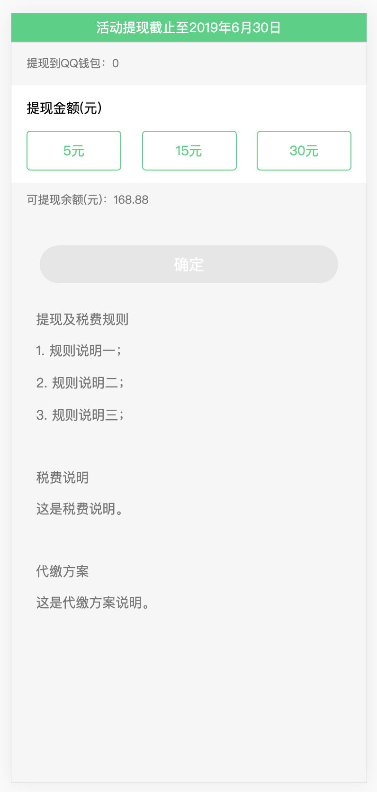
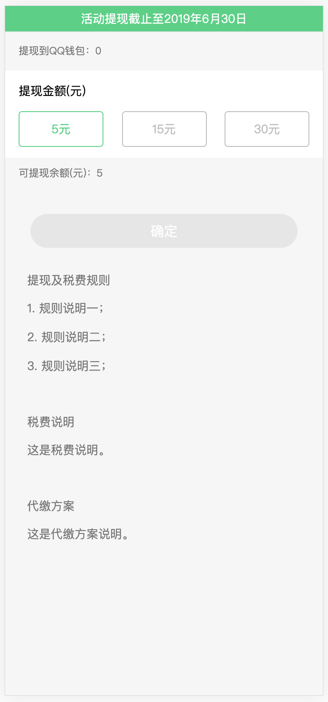
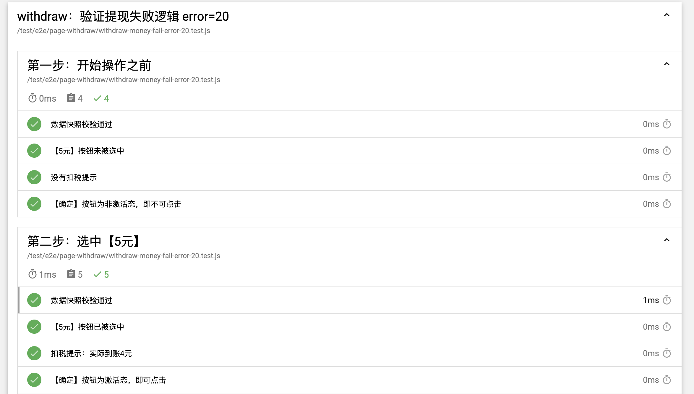

# 04. 重交互界面

本节我们将通过一个交互型页面例子来讨论如何进行页面的测试。

## 1. 测试概述



本页面是一个非常重交互的页面，而且涉及到金钱交易。是非常需要测试来确保其逻辑正确的。

这里我们仅仅通过上面的四种情况来分析，其余的报错、鉴权等，大家可以查看我们的 [案例代码](https://github.com/matmanjs/matman-demo/tree/master/test/e2e/page-withdraw)。

我们需要验证的情况有下面四种：

- 用户余额大于等于提现选项的 `最大值`
- 用户余额大于等于 `某些` 提现选项

- 用户余额小于 `所有` 提现选项
- 用于余额为 `0`

我们的测试思路很简单，分别获取不同的 DOM 信息进行判断即可

## 2. 获取页面数据快照

### 2.1 爬虫脚本

在 `DevOps/matman-app/case_modules/page-withdraw/crawlers/get-page-info.js` 文件中，有我们获取页面信息内容的脚本：

我们将页面进行了划分，以便编写分别的函数来获取其状态：

- 消息提示部分
- 提现区域
- 规则区域
- 提示弹窗
- Toast提示


具体的代码逻辑大家可以参考下面的代码：

```js
const { useJquery } = require('web-crawl-util');

module.exports = () => {
  return {
    noticeInfo: getNoticeInfo(),
    withdrawInfo: getWithdrawInfo(),
    ruleInfo: getRuleInfo(),
    alertInfo: getAlertInfo(),
    toastInfo: getToastInfo(),
  };
};

/**
 * 消息提示
 */
function getNoticeInfo() {
  const parentSelector = '#root .display-notice';

  const result = {
    isExist: useJquery.isExist(parentSelector),
  };

  if (result.isExist) {
    result.txt = useJquery.getText('.txt', parentSelector);
  }

  return result;
}

/**
 * 提现区域
 */
function getWithdrawInfo() {
  const parentSelector = '#root .display-withdraw';

  const result = {
    isExist: useJquery.isExist(parentSelector),
  };

  if (result.isExist) {
    result.walletTips = useJquery.getText('.withdraw-wallet-tips', parentSelector);
    result.quotaTitle = useJquery.getText('.display-withdraw-quotas .title', parentSelector);

    result.quotaCount = useJquery.getTotal(
      '.display-withdraw-quotas .selection .item',
      parentSelector,
    );

    function getQuotaItem(i) {
      const jqDom = $('.display-withdraw-quotas .selection .item.i' + i, parentSelector);
      return {
        text: useJquery.getText(jqDom),
        isAvailable: jqDom.hasClass('available'),
        isSelected: jqDom.hasClass('active'),
      };
    }

    result.quota0 = getQuotaItem(0);
    result.quota1 = getQuotaItem(1);
    result.quota2 = getQuotaItem(2);

    result.taxedTips = useJquery.getText('.display-withdraw-quotas .tips-taxed', parentSelector);
    result.balanceTips = useJquery.getText('.withdraw-balance-tips', parentSelector);

    result.submitTxt = useJquery.getText('.withdraw-submit .now-button', parentSelector);
    result.isSubmitActive = !$('.withdraw-submit .now-button', parentSelector).hasClass('disabled');
  }

  return result;
}

/**
 * 规则区域
 */
function getRuleInfo() {
  const parentSelector = '#root .display-rule';

  const result = {
    isExist: useJquery.isExist(parentSelector),
  };

  if (result.isExist) {
    function getRuleItem(i) {
      const jqDom = $('.section-' + i, parentSelector);

      const title = useJquery.getText('h2', jqDom);
      const rules = [];
      $('p', jqDom).each(function () {
        rules.push($.trim($(this).text()));
      });

      return {
        title,
        rules,
      };
    }

    result.count = useJquery.getTotal('.section', parentSelector);

    result.rule0 = getRuleItem(1);
    result.rule1 = getRuleItem(2);
    result.rule2 = getRuleItem(3);
  }

  return result;
}

/**
 * 弹窗提示，某些情况下才可能会出现
 */
function getAlertInfo() {
  const parentSelector = '.base-alert';

  const result = {
    isExist: useJquery.isExist(parentSelector),
  };

  if (result.isExist) {
    result.content = useJquery.getText('.dialog-inner .dialog-text .text', parentSelector);
    result.btnTxt = useJquery.getText(
      '.dialog-inner .dialog-buttons .dialog-btn.ok',
      parentSelector,
    );
  }

  return result;
}

/**
 * toast提示，某些情况下才可能会出现
 */
function getToastInfo() {
  const parentSelector = '.now-apptoast';

  const result = {
    isExist: useJquery.isExist(parentSelector),
  };

  if (result.isExist) {
    result.content = useJquery.getText(parentSelector);
  }

  return result;
}

```

### 2.2 启动脚本

#### 2.2.1 基本检查

在 `DevOps/matman-app/case_modules/page-withdraw/basic-check.js` 文件中，我们利用matman 编写端到端测试的逻辑，内容如下（仅仅检查数据上报与页面健康状态，需要注意的是我们一定需要一个 action 这样才可以捕捉页面的快照）：

```js
module.exports = async pageDriverOpts => {
  // 创建 PageDriver
  const pageDriver = await createPageDriver(__filename, pageDriverOpts, BASIC_QUERY_DATA_MAP);

  // 本页面实际需要有登录态信息，自动化测试时手动设置 cookie
  await pageDriver.setCookieConfig('myuin=123456');

  // 设置页面地址
  await pageDriver.setPageUrl('http://now.qq.com/withdraw');

  // 增加自定义动作
  await pageDriver.addAction('init', async page => {
    await page.waitFor(WAIT.READY);
  });

  // 获取结果
  return pageDriver.evaluate(path.resolve(__dirname, './crawlers/get-page-info.js'));
};
```

- 使用 matman 执行无头浏览器模拟浏览，调用爬虫脚本得到数据快照
- 这里我们使用 setCookieConfig 设置了用户的登录状态，这在之前的代码是没有的

#### 2.2.2 基本提现操作

在 `DevOps/matman-app/case_modules/page-withdraw/withdraw-money-basic.js` 文件中，我们利用matman 编写端到端测试的逻辑：

- 还未选择提现金额之前，直接点击【确定】按钮
- 点击提示没有选择金额的弹窗中的【确定】按钮
- 选中【30元】
- 选中【15元】
- 点击【确定】按钮
- 点击弹窗中的【确定】按钮

```js
module.exports = async pageDriverOpts => {
  // 创建 PageDriver
  const pageDriver = await createPageDriver(__filename, pageDriverOpts, BASIC_QUERY_DATA_MAP);

  // 本页面实际需要有登录态信息，自动化测试时手动设置 cookie
  await pageDriver.setCookieConfig('myuin=123456');

  await pageDriver.setPageUrl('http://now.qq.com/withdraw');

  // 第一步：开始操作之前
  await pageDriver.addAction('init', async page => {
    await page.waitFor(WAIT.READY);
  });

  // 第二步：还未选择提现金额之前，直接点击【确定】按钮
  await pageDriver.addAction('clickSubmitBeforeSelect', async page => {
    await page.click('#root .display-withdraw .withdraw-submit .now-button');
    await page.waitFor(500);
  });

  // 第三步：点击提示没有选择金额的弹窗中的【确定】按钮
  await pageDriver.addAction('clickNotSelectMoneyDlgOk', async page => {
    await page.click('.base-alert .dialog-inner .dialog-buttons .dialog-btn.ok');
  });

  // 第四步：选中【30元】
  await pageDriver.addAction('selectQuota30', async page => {
    await page.click('#root .display-withdraw .display-withdraw-quotas .selection .i2');
  });

  // 第五步：选中【15元】
  await pageDriver.addAction('selectQuota15', async page => {
    await page.click('#root .display-withdraw .display-withdraw-quotas .selection .i1');
  });

  // 第六步：点击【确定】按钮
  await pageDriver.addAction('clickSubmit', async page => {
    await page.click('#root .display-withdraw .withdraw-submit .now-button');
    await page.waitFor(500);
  });

  // 第七步：点击弹窗中的【确定】按钮
  await pageDriver.addAction('clickDlgOk', async page => {
    await page.click('.base-alert .dialog-inner .dialog-buttons .dialog-btn.ok');
  });

  // 第八步：一秒后再次获取页面状态
  await pageDriver.addAction('lastCheck', async page => {
    await page.waitFor(1000);
  });

  return pageDriver.evaluate(path.resolve(__dirname, './crawlers/get-page-info.js'));
};
```

#### 2.2.3 活动过期等错误情况

在 `DevOps/matman-app/case_modules/page-withdraw/withdraw-money-fail.js` 文件中，我们利用matman 编写端到端测试的逻辑，这个逻辑就比较简单了验证报错提示信息即可：

- 选中【5元】
- 点击【确定】按钮
- 点击弹窗中的【确定】按钮

```js
module.exports = async pageDriverOpts => {
  // 创建 PageDriver
  const pageDriver = await createPageDriver(__filename, pageDriverOpts, BASIC_QUERY_DATA_MAP);

  // 本页面实际需要有登录态信息，自动化测试时手动设置 cookie
  await pageDriver.setCookieConfig('myuin=123456');

  await pageDriver.setPageUrl('http://now.qq.com/withdraw');

  // 第一步：开始操作之前
  await pageDriver.addAction('init', async page => {
    await page.waitFor(WAIT.READY);
  });

  // 第二步：选中【5元】
  await pageDriver.addAction('selectQuota', async page => {
    await page.click('#root .display-withdraw .display-withdraw-quotas .selection .i0');
  });

  // 第三步：点击【确定】按钮
  await pageDriver.addAction('clickSubmit', async page => {
    await page.click('#root .display-withdraw .withdraw-submit .now-button');
    await page.waitFor(500);
  });

  // 第四步：点击弹窗中的【确定】按钮
  await pageDriver.addAction('clickDlgOk', async page => {
    await page.click('.base-alert .dialog-inner .dialog-buttons .dialog-btn.ok');
  });

  return pageDriver.evaluate(path.resolve(__dirname, './crawlers/get-page-info.js'));
};
```

## 3. 测试样例文件

>- 本部分的测试会很多、很杂，我们只为大家展示分析需要重点关注的部分，有关数据上报、监控等不再展示
>- 完全的逻辑与代码可以 [参考](https://github.com/matmanjs/matman-demo/tree/master/test/e2e/page-withdraw)

我们刚刚探讨了需要检验的几种情况，分别为：

- 根据用户余额锁定按钮
- 提现失败错误提示
- 正常情况

### 3.1 锁定按钮

我们通过 mock 接口返回可以提现金额为 `23.4` 元，那么三个提现按钮中 30 元这个选项是不可以点击的。

- 首先检验完整的数据快照结果
- 接着判断三个按钮的状态

返回 `4.99`、`5.00`、`0`、`168.8` 等都与此类似，注意区分即可。

```js
it('数据快照校验通过', function () {
  expect(data).to.eql({
    alertInfo: { isExist: false },
    noticeInfo: { isExist: true, txt: '活动提现截止至2019年6月30日' },
    ruleInfo: {
      count: 3,
      isExist: true,
      rule0: {
        rules: ['1. 规则说明一；', '2. 规则说明二；', '3. 规则说明三；'],
        title: '提现及税费规则',
      },
      rule1: { rules: ['这是税费说明。'], title: '税费说明' },
      rule2: { rules: ['这是代缴方案说明。'], title: '代缴方案' },
    },
    toastInfo: { isExist: false },
    withdrawInfo: {
      balanceTips: '可提现余额(元)：23.4',
      isExist: true,
      isSubmitActive: false,
      quota0: { isAvailable: true, isSelected: false, text: '5元' },
      quota1: { isAvailable: true, isSelected: false, text: '15元' },
      quota2: { isAvailable: false, isSelected: false, text: '30元' },
      quotaCount: 3,
      quotaTitle: '提现金额(元)',
      submitTxt: '确定',
      taxedTips: '',
      walletTips: '提现到QQ钱包：123456',
    },
  });
});

it('【15元】按钮可以被选择', function () {
  expect(data.withdrawInfo.quota1.isAvailable).to.be.true;
});

it('【15元】按钮未被选中', function () {
  expect(data.withdrawInfo.quota1.isSelected).to.be.false;
});

it('【30元】按钮不可选择', function () {
  expect(data.withdrawInfo.quota2.isAvailable).to.be.false;
});

it('没有扣税提示', function () {
  expect(data.withdrawInfo.taxedTips).to.be.empty;
});
```

### 3.2 错误提示信息

首先在 before 钩子中，设置需要返回的信息：

```js
before(async function () {
  matmanResult = await checkPage({
    show: false,
    doNotCloseBrowser: false,
    useRecorder: true,
    queryDataMap: {
      withdraw_money: 'error_20_active_empty',
    },
  });
});
```

这里返回了活动不存在这个报错，可以根据自己的 mock 模式自由指定，接着对应的接口请求信息，与报错提示的正确性：

```js
it('弹出提示框，提示成功', function () {
  expect(data.alertInfo.content).to.equal('该活动不存在，请重新加载');
});

it('请求了 withdraw_money 接口（提现接口）', function () {
  const result = matmanResult.isExistXHR(
    '//cgi.now.qq.com/cgi-bin/a/b/withdraw_money',
    {
      activeid: 10001,
      amount: 500,
    },
    200,
  );

  expect(result).to.be.true;
});
```

在这里通过判断提示框中的提示语句，判定我们的得到了正确的报错信息与对应的接口请求，其他的报错与此类似。

### 3.3 正常提现

正常提现其实只要在之前的基础上判断两件事：

- 页面余额变化
- 成功跳转页面

接下来我们针对这样的场景，进行编写，首先进行初始的判断：

```js
it('数据快照校验通过', function () {
  expect(data).to.eql({
    alertInfo: {
      btnTxt: '确定',
      content:
        '你的15元（税前）提现申请已提交，税后实际到账12元。请到QQ钱包-点击QQ钱包余额数字-交易记录查看。',
      isExist: true,
    },
    noticeInfo: {isExist: true, txt: '活动提现截止至2019年6月30日'},
    ruleInfo: {
      count: 3,
      isExist: true,
      rule0: {
        rules: ['1. 规则说明一；', '2. 规则说明二；', '3. 规则说明三；'],
        title: '提现及税费规则',
      },
      rule1: {rules: ['这是税费说明。'], title: '税费说明'},
      rule2: {rules: ['这是代缴方案说明。'], title: '代缴方案'},
    },
    toastInfo: {isExist: false},
    withdrawInfo: {
      balanceTips: '可提现余额(元)：23.4',
      isExist: true,
      isSubmitActive: true,
      quota0: {isAvailable: true, isSelected: false, text: '5元'},
      quota1: {isAvailable: true, isSelected: true, text: '15元'},
      quota2: {isAvailable: false, isSelected: false, text: '30元'},
      quotaCount: 3,
      quotaTitle: '提现金额(元)',
      submitTxt: '确定',
      taxedTips: '实际到账：12元(根据国家税务总局规定收取20%红包个人所得税)',
      walletTips: '提现到QQ钱包：123456',
    },
  });
});
```

之后用户提现 15 元，接着进行整体快照的判断，主要可以关注提现的余额：

```js
it('数据快照校验通过', function () {
  expect(data).to.eql({
    alertInfo: { isExist: false },
    noticeInfo: { isExist: true, txt: '活动提现截止至2019年6月30日' },
    ruleInfo: {
      count: 3,
      isExist: true,
      rule0: {
        rules: ['1. 规则说明一；', '2. 规则说明二；', '3. 规则说明三；'],
        title: '提现及税费规则',
      },
      rule1: { rules: ['这是税费说明。'], title: '税费说明' },
      rule2: { rules: ['这是代缴方案说明。'], title: '代缴方案' },
    },
    toastInfo: { isExist: false },
    withdrawInfo: {
      balanceTips: '可提现余额(元)：8.4',
      isExist: true,
      isSubmitActive: false,
      quota0: { isAvailable: true, isSelected: false, text: '5元' },
      quota1: { isAvailable: false, isSelected: false, text: '15元' },
      quota2: { isAvailable: false, isSelected: false, text: '30元' },
      quotaCount: 3,
      quotaTitle: '提现金额(元)',
      submitTxt: '确定',
      taxedTips: '',
      walletTips: '提现到QQ钱包：123456',
    },
  });
});
```

最后判断跳转结果：

```js
describe('第八步：一秒后再次获取页面状态', function () {
  let data;

  before(function () {
    data = matmanResult.get('lastCheck');
  });

  it('跳转到了首页', function () {
    expect(matmanResult.isExistPage('/abc/index', {}, 200)).to.be.true;
  });
});
```

到这里我们已经把大致的测试思路说明完成了。

## 4. 测试结果


